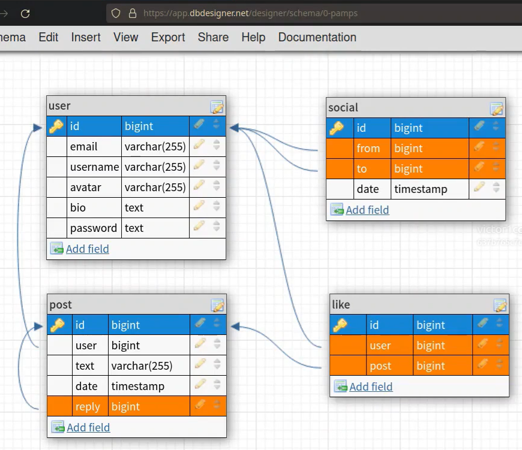

## GITPOD

 - Ambiente de desenvolvimento em nuvem Linux, com interface de VSCODE que roda em browser. Não é necessario instalar docker, imagens ou ambiente virtual (VENV).  
 - Alem de compartilhar o script com o time, inclui todo o ambiente. Evitando assim, problemas de versão de biblioteca, atualizações e etc.  
 - Ao criar um workspace, é criado um **container com VSCODE** instalado que roda em Linux.
 ---
## CRIANDO UMA API DO ZERO
  
Curso de python backend criando, executando e testando um API com FastAPI. Criaremos um *Blog* simples.

----

*Venv* serve para ambiente de DEV. Para a produção jogamos dentro do container com os pacotes. 

Primeira coisa é atualizar o pip.  
Em seguida instalar o requirements.
```
pip install --upgrade pip
pip install -r requirements-dev.txt
```
---
## Estrutura de pastas e arquivos
Script para criar os arquivos do projeto.
```
# Arquivos na raiz
touch setup.py
touch {settings,.secrets}.toml
touch {requirements,MANIFEST}.in
touch Dockerfile.dev docker-compose.yaml

# Imagem do banco de dados
mkdir postgres
touch postgres/{Dockerfile,create-databases.sh}

# Aplicação
mkdir -p pamps/{models,routes}
touch pamps/default.toml
touch pamps/{__init__,cli,app,auth,db,security,config}.py
touch pamps/models/{__init__,post,user}.py
touch pamps/routes/{__init__,auth,post,user}.py

# Testes
touch test.sh
mkdir tests
touch tests/{__init__,conftest,test_api}.py
```
Esta será a estrutura final (se preferir criar manualmente)

```
❯ tree -a -I docs -I .git
.
├── docker-compose.yaml        # Orquestração de containers
├── Dockerfile.dev             # Imagem principal
├── MANIFEST.in                # Arquivos incluidos na aplicação
├── requirements-dev.txt       # Dependencias de ambiente dev
├── requirements.in            # Dependencias de produção
├── .secrets.toml              # Senhas locais
├── settings.toml              # Configurações locais
├── setup.py                   # Instalação do projeto
├── test.sh                    # Pipeline de CI em ambiente dev
├── pamps
│   ├── __init__.py
│   ├── app.py                 # FastAPI app
│   ├── auth.py                # Autenticação via token
│   ├── cli.py                 # Aplicação CLI `$ pamps adduser` etc
│   ├── config.py              # Inicialização da config
│   ├── db.py                  # Conexão com o banco de dados
│   ├── default.toml           # Config default
│   ├── security.py            # Password Validation
│   ├── models
│   │   ├── __init__.py
│   │   ├── post.py            # ORM e Serializers de posts
│   │   └── user.py            # ORM e Serialziers de users
│   └── routes
│       ├── __init__.py
│       ├── auth.py            # Rotas de autenticação via JWT
│       ├── post.py            # CRUD de posts e likes
│       └── user.py            # CRUD de user e follows
├── postgres
│   ├── create-databases.sh    # Script de criação do DB
│   └── Dockerfile             # Imagem do SGBD
└── tests
    ├── conftest.py            # Config do Pytest
    ├── __init__.py
    └── test_api.py            # Tests da API
```

## Requirements.in
Não serve para o deploy de aplicação. Necessario as versoes de cada library.
O comando abaixo gera um txt com as versões.

``` pip-compile requirements.in ```  

alembic==1.8.1  
    # via -r requirements.in  
anyio==3.6.2 ...

## Pamps/app.py
Instanciar 

## MANIFEST.in
Quero rodar isso dentro de um container, por isso preciso criar o instalador do pamps.
Listar todos os arquivos que são necessarios para rodar o programa.  
> ls pamps - mostra todos os arquivos dentro do pamps
> graft pamps - arrasta os arquivos dentro do pamps.

## SETUP.py
Arquivo de confirguração basica, simplesmente copiar de outros projetos e colar nesse.
Ele permite ler a biblioteca requirements.txt, criar uma lista e instalar todos.

----
## Instalar as libs  
``` pip install -e. ```

Ira instalar localmente nesse primeiro momento, e o projeto pamps.
>> R: Running setup.py develop for pamps  
OK!

Mostra os detalhes do projeto:  
``` pip show pamps  ```

----
# Containers

Os containers Linux® e as máquinas virtuais são ambientes de computação empacotados que combinam vários componentes de TI e os isolam do restante do sistema. As principais diferenças entre eles tema ver com escala e portabilidade. Como EMPACOTAR O APLICAÇÃO ?

**-Containers** : costumam ser usados para empacotar funções individuais que realizam tarefas específicas, os famosos microsserviços. Como são leves e têm um sistema operacional compartilhado, os containers são muito fáceis de migrar entre vários ambientes.  

>Imagem é um template que será utilizado por seu container. Nela é definido o que vai rodar ali dentro, quais as bibliotecas e configurações estarão presentes no seu container.

*As novas práticas de TI* (desenvolvimento nativo em nuvem, CI/CD e DevOps) existem graças à divisão das cargas de trabalho nas menores unidades úteis possíveis, que geralmente são uma função ou um microsserviço. Essas unidades são melhor empacotadas em containers.

Nas arquiteturas de *TI tradicionais* (monolíticas e legadas), todos os elementos de uma carga de trabalho são mantidos em um arquivo grande que não pode ser dividido. Por isso, ele precisa ser empacotado como uma unidade completa em um ambiente maior, frequentemente uma máquina virtual.

**-Docker** : plataforma open source para construir, armazenar, distribuir e rodar contêineres.  
**-Kubernetes** : gerenciador de contêineres .
---

Na nossa aplicação, vamos definir no **Dockerfile.dev** é uma camada sendo definido no conteiner.
Utilizaremos um script padrão.

### CRIAR A IMAGEM (é necessario rodar somente a primeira vez)
> no terminal rodar:  
``` docker build -f Dockerfile.dev -t pamps:latest .  ```

-f file  
-t tag(nome para esse arquivo, ou pode usar 0.1.0)  
. IMPORTANTE utilizar o *ponto* pois quero criar a imagem no local que eu estou.  
> Successfully built 56f8527587dd  
> Successfully tagged pamps:latest

A imagem fica guardada para sempre, o Container sera criado apartir dessa imagem.  
Containers são efemeros, por isso devemos utilizar --rm  
```docker run --rm -it -v $(pwd):/home/app/api -p 8000:8000 pamps  ```  
--rm remove  
-it iterative  
-v volume + local e imagem (pamps)

API RODANDO!! 
Ja possuo a porta de acesso a minha API: *http://0.0.0.0:8000*  
Se colocar */docs* gera automaticamente um swagger (origem app.py)

A API vai ser atualizada automaticamente quando detectar mudanças no código, somente para teste edite pamps/app.py e adicione

```
@app.get("/")
async def index():
    return {"hello": "world"}
```
## POSTGRESQL  




É um sistema gerenciador de banco de dados Open Source. Para isso vamos utilizar o PostgreSQL dentro de um container.

**Pamps > Models** - Sera a nossa Modelagem do DB.

Vamos modelar o banco de dados definido acima usando o SQLModel, que é uma biblioteca que integra o SQLAlchemy e o Pydantic e funciona muito bem com o FastAPI.  
O SQLModel e FASTApi são baseados em tipagem.

Colar o codigo dentro de postgres > create-databases.sh. sh é linguagem bash.
Com isso conseguimos automatizar um codigo para criar o DB.

---
Utilizaremos o **docker_compose.yaml** para subir ao mesmo tempo o DB e a API.  
**Docker_Compose** - é uma ferramenta usada para definir e executar aplicativos de vários contêineres do Docker.  
**YAML** - define todos os serviços a serem implantados. Serializador, tipo json.

Dentro do arquivo temos :  
> PAMPS_DB__uri: "postgresql://postgres:postgres@db:5432/${PAMPS_DB:-pamps}"   
nome de usuario: senha : porta : nome do banco.

Edite o arquivo docker-compose.yaml

- Definimos 2 serviços api e db  
- Informamos os parametros de build com os dockerfiles
- Na api abrimos a porta 8000
- Na api passamos 2 variáveis de ambiente PAMPS_DB__uri e PAMPS_DB_connect_args para usarmos na conexão com o DB
- Marcamos que a api depende do db para iniciar.
- No db informamos o setup básico do postgres e pedimos para criar 2 bancos de dados, um para a app e um para testes.

### Docker compose
Agora para iniciar a nossa API + o Banco de dados vamos precisar de um orquestrador de containers, em produção isso será feito com Kubernetes mas no ambiente de desenvolvimento podemos usar o docker-compose.

Edite o arquivo docker-compose.yaml

- Definimos 2 serviços api e db  
- Informamos os parametros de build com os dockerfiles  
- Na api abrimos a porta 8000  
- Na api passamos 2 variáveis de ambiente 
- PAMPS_DB__uri e PAMPS_DB_connect_args para usarmos na conexão com o DB  
- Marcamos que a api depende do db para iniciar.  
- No db informamos o setup básico do postgres e pedimos para criar 2 bancos de dados, um para a app e um para testes.

Executar a linha abaixo para rodar os dois containers:  
``` docker-compose up ```

---
### MODELAGEM

### Definindo os models com Pydantic

Vamos modelar o banco de dados definido acima usando o SQLModel, que é uma biblioteca que integra o SQLAlchemy e o Pydantic e funciona muito bem com o FastAPI.  


### Settings
Agora que temos pelo menos uma tabela mapeada para uma classe precisamos estabelecer conexão com o banco de dados e para isso precisamos carregar configurações

Edite o arquivo pamps/default.toml

Vamos agora inicializar a biblioteca de configurações:

Edite pamps/config.py

### Conexão com o banco de dados
db.py - Sera o engine do banco de dados
Utiliza o boiler plate (template), e ajustar conforme necessario.

### DATABASE MIGRATIONS  
Ferramenta que ira gerar um SQL baseado no script python, para gerar um banco de dados.

``` alembic init migrations
```
Ira criar a pasta migrations. Alembic é a ferramenta de Database migrations.

Agora vamos rodar os comando dentro do container.
Antes era executado dentro da minha maquina.
``` docker-compose exec api /bin/bash    
```

Agora este é o shell dentro do container.  
>app@902b4a5e743a:~/api$

